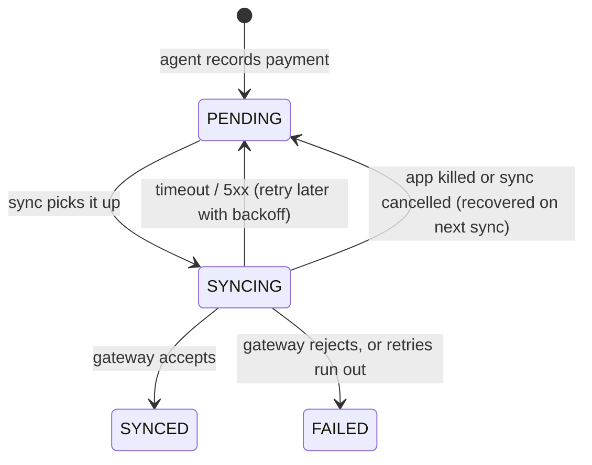
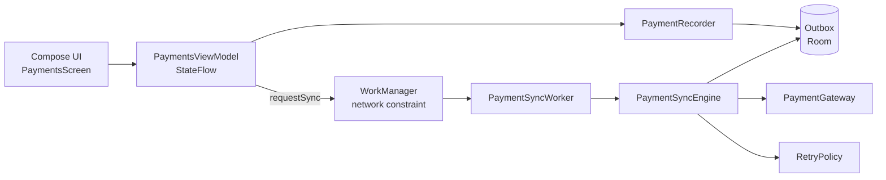

# Offline Payment Sync

[](https://github.com/manojppatil/offline-payment-sync/actions/workflows/ci.yml)

An Android app for field agents who collect loan repayments in places with weak or no mobile signal. A payment is recorded on the phone first, then sent to the payment gateway when there is a connection, with retries that can never charge a customer twice.

Kotlin · Jetpack Compose · Coroutines and Flow · Room · WorkManager · Hilt · MVVM

## The problem

In rural lending, an agent might take ten EMI payments in a village with one bar of signal. If the app needs the network at the moment of payment, the agent either can't record it or retries blindly and risks a duplicate charge. This project shows one way to make that safe:

1. **Record locally, always.** The payment goes into a local outbox (Room) and the agent can move on.
2. **Send when possible.** WorkManager runs a sync whenever the phone has a network connection.
3. **Retry without double charging.** Each payment's id is sent as an idempotency key, so a retry after a timeout is recognised by the gateway as the same payment.

## How a payment moves



## Architecture



The project has two modules:

| Module | What's in it | Depends on Android? |
|---|---|---|
| `sync-core` | Payment model, outbox and gateway interfaces, `PaymentSyncEngine`, `RetryPolicy`, `PaymentRecorder`, `Money` | No: plain Kotlin, tested on the JVM |
| `app` | Compose UI, ViewModel, Room outbox, WorkManager worker, Hilt wiring, simulated gateway | Yes |

Keeping the sync rules in a plain Kotlin module means the logic that matters most runs its tests in milliseconds, with no emulator.

## Design decisions

**Money is a `Long` of paise.** Amounts are parsed with `BigDecimal` and stored as minor units, so floating point never touches money. Display uses Indian digit grouping (`₹1,23,456.78`).

**The payment id is the idempotency key.** Every retry of a payment sends the same key. The simulated gateway honours it the way a real one would: a repeated request returns the original reference instead of a second charge.

**Two layers of backoff.** `RetryPolicy` gives each payment its own next-attempt time (exponential, capped at 5 minutes, with jitter so a hundred phones coming back online don't retry at the same moment). WorkManager's own backoff decides when the worker wakes up to check again.

**Retryable and final failures are kept apart.** Timeouts and server errors are retried; a rejection such as "above the single-payment limit" fails immediately, because retrying would get the same answer.

**Interrupted syncs recover themselves.** Only one sync runs at a time (a `Mutex`, plus unique work in WorkManager). So when a sync starts, any payment still marked `SYNCING` was interrupted by process death and is safe to resend. If a sync is cancelled mid-request, the engine puts the payment back to `PENDING` inside `NonCancellable` before letting the cancellation through.

## Tests

```bash
./gradlew :sync-core:test            # sync rules, retry policy, money parsing (26 tests)
./gradlew :app:testDebugUnitTest     # ViewModel
```

`PaymentSyncEngineTest` covers: accepted, retried, rejected and given-up payments; the idempotency key staying the same across retries; payments not sent before their retry time; recovery of a payment stuck in `SYNCING`; and a cancelled sync putting its payment back to `PENDING`.

CI runs both test suites and builds the debug APK on every push.

## Running it

Open the project in Android Studio (Ladybug or newer) and run the `app` configuration on a device or emulator with API 24+.

To see the offline behaviour, turn on airplane mode, record a few payments, then turn it off. The simulated gateway adds 700 ms of latency, times out on 30% of requests, and rejects single payments above ₹50,000.

## What a production version would add

- A real gateway client (Retrofit or the gateway's SDK) behind the same `PaymentGateway` interface
- Encrypting the local database (SQLCipher) and the customer data in it
- An agent-facing screen to resolve `FAILED` payments
- Server-side reconciliation of the day's collections against the outbox

## License

MIT
